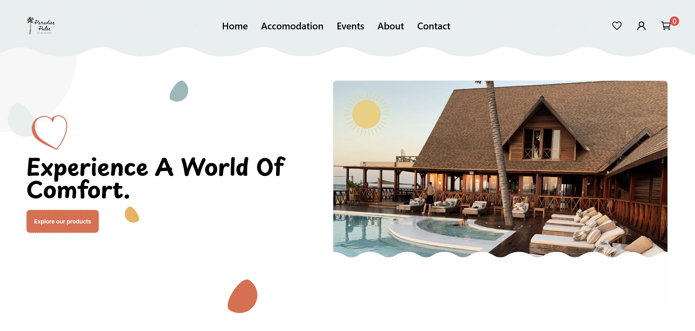
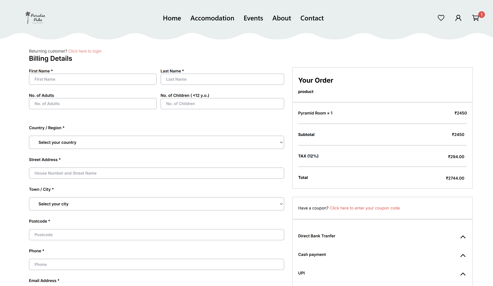
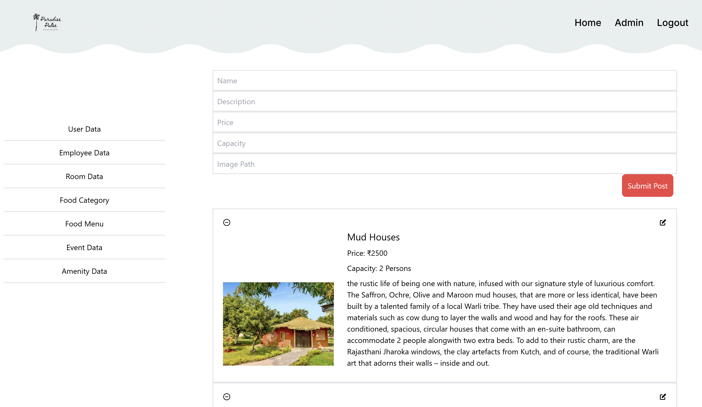

# 🏝️ Resort Management

## 📖 Description
Resort Management is a web application designed to simplify the booking and management process for resorts. It allows users to browse available rooms, make reservations, manage bookings, and handle services offered by the resort efficiently.

## 🔗 Live Demo
Check out the live demo here: [https://paradise-pulse.vercel.app/](https://paradise-pulse.vercel.app/)

## ✨ Features
- 🛏️ Browse resort rooms with details  
- 📅 Book rooms with check-in and check-out dates  
- 🔄 Manage bookings with options to modify or cancel  
- 🛠️ Admin dashboard to add, update, or remove rooms and services  
- 🔐 User authentication and profile management  

## 🖼️ Screenshots

### Home Page  


### Room Listing  


### Booking Page  


### Admin Dashboard  


## 🚀 Installation

1. Clone the repository:
   ```bash
   git clone https://github.com/your-username/resort-management.git
   cd resortmanagement
   npm install
   npm run dev

## 💻 Usage
Open http://localhost:3000 in your browser.

🆕 Sign up or 🔑 log in to browse and book rooms.

🛎️ Admin users can access the dashboard to manage resort details.

## 🛠️ Technologies Used

⚛️ Next.js for frontend and backend

🍃 MongoDB for database

🎨 CSS/Tailwind for styling
